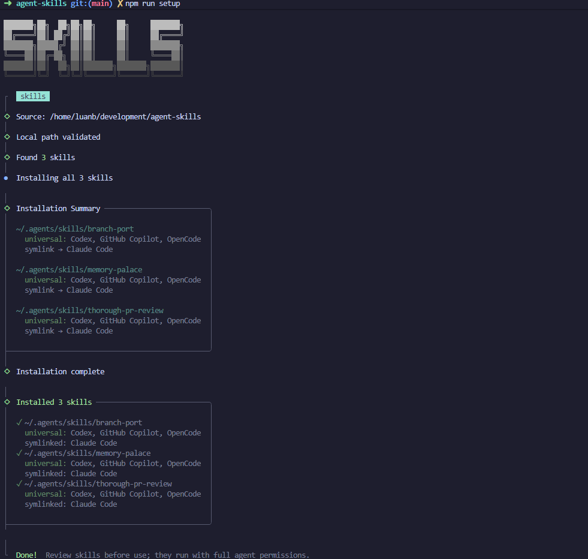

# Personal Agent Skills

Public source of truth for my global agent instructions, personal skills, curated third-party skill references, and non-skill tool references.



This repo supports:

- Claude Code
- Codex
- Copilot
- OpenCode

## Layout

```text
.
|-- AGENTS.md                # Global reusable agent instructions
|-- skills/                  # Personal skills authored here
|-- curated-skills.json      # Third-party skills I use; also drives curated install
|-- curated-tools.json       # Non-skill tools, CLIs, packages, and docs I use
|-- scripts/                 # Install helpers
|-- package.json             # Small npm command surface
`-- README.md
```

## Install

Install package dependencies from a local checkout:

```bash
npm install
```

Install global skills and instructions:

```bash
npm run setup
```

Default mode uses symlinks where the target tool supports normal files. Use copy mode when symlinks are not desirable:

```bash
npm run setup:copy
```

What `npm run setup` does:

- Installs personal skills from `skills/` for `claude-code`, `codex`, `github-copilot`, and `opencode` using `npx skills`.
- Installs curated third-party skills from `curated-skills.json` where `preferredInstall` is `skills-cli`.
- Installs global `AGENTS.md` guidance for Claude, Codex, Copilot, and OpenCode.

## Commands

```bash
npm run skills:list              # list personal skills in this repo
npm run install:skills           # install only personal skills
npm run install:curated          # install only curated skills-cli sources
npm run install:curated:dry-run  # preview curated skill install commands
npm run install:agents           # install only global AGENTS.md guidance
npm run setup                    # full symlink setup
npm run setup:copy               # full copy setup
npm run setup:memory-palace      # persist the default memory-palace vault path
npm run verify                   # non-destructive verification pass
```

## Personal Skills

Personal skills live in `skills/<skill-name>/SKILL.md`.

Current personal skills:

| Skill | Purpose |
| --- | --- |
| `branch-port` | Port a feature across heavily diverged branches without unsafe merges |
| `memory-palace` | Ingest, query, and lint the personal Obsidian knowledge vault |
| `thorough-pr-review` | Review PRs and branches for correctness, reliability, and merge-readiness |

List local personal skills:

```bash
npm run skills:list
```

### Memory Palace Vault Path

Configure the default vault path once so the `memory-palace` skill works from any current directory:

```bash
npm run setup:memory-palace -- --vault /mnt/c/Users/<you>/Documents/<vault>
```

If you are running from WSL and your vault lives on Windows, paste the Windows path from Explorer:

```bash
npm run setup:memory-palace -- --vault "C:\Users\user-name\Documents\Obsidian Vaults\obsidian-vault"
```

The setup script converts it to a WSL-accessible path before saving it.

The setting is saved at `~/.agents/memory-palace/config.json`:

```json
{
  "vaultPath": "/mnt/c/Users/<you>/Documents/<vault>",
  "configuredAt": "2026-06-15T00:00:00.000Z",
  "sourceInput": "C:\\Users\\<you>\\Documents\\<vault>"
}
```

Resolution precedence inside the skill is:

1. explicit vault path in the current user request
2. `MEMORY_PALACE_VAULT`
3. `~/.agents/memory-palace/config.json`
4. current-directory detection as a fallback

On WSL, Windows paths like `C:\Users\...` are expected and are converted to `/mnt/c/Users/...` before validation and saving. The saved path must already be accessible from WSL.

## Curated References

`curated-skills.json` tracks third-party skills I use. It remains machine-readable and drives `npm run install:curated` for entries where `preferredInstall` is `skills-cli`.

Plugin-style entries can remain in `curated-skills.json` as references, but the installer skips them and reports them as skipped. Install those through their agent/plugin marketplace flow.

`curated-tools.json` tracks non-skill tools, CLIs, packages, and docs I use. It is a reference catalog only; it does not drive installation.

## Global Instructions

`AGENTS.md` is the source of truth for global agent behavior.

`npm run install:agents` installs it to:

- Codex: `~/.codex/AGENTS.md`
- Claude: `~/.claude/AGENTS.md` plus `~/.claude/CLAUDE.md` importing `@AGENTS.md`
- Copilot: `~/.copilot/AGENTS.md` plus `~/.copilot/instructions/global-agent.instructions.md`
- OpenCode: `~/.config/opencode/AGENTS.md` plus a global config `instructions` entry

Default mode symlinks those targets back to this repo. `npm run setup:copy` copies file contents instead.

After changing OpenCode config, restart OpenCode. Running sessions keep using already-loaded config.

## Verify

Run the non-destructive repo checks:

```bash
npm run verify
```

Optional runtime checks:

```bash
codex --ask-for-approval never "Summarize current instructions."
```

For OpenCode, inspect `~/.config/opencode/opencode.jsonc` and confirm the `instructions` array includes `~/.config/opencode/AGENTS.md`.

## Safety

This repository is public. Do not add private dashboards, tokens, org IDs, internal URLs, API keys, or generated local memory context.
