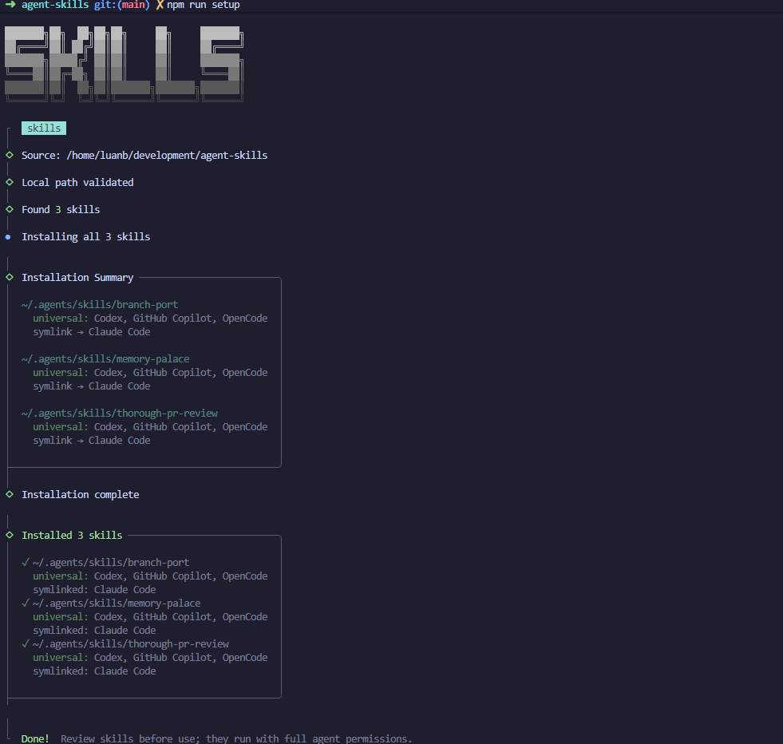

# Personal Agent Skills

Public source of truth for my global agent instructions, personal skills, curated third-party skill references, and non-skill tool references.



This repo supports:

- Claude Code
- Codex
- Copilot
- OpenCode
- Pi
- Cursor

## Quick Start

Pick one path:

- [Skills only](#skills-only): personal skills from GitHub. No clone.
- [Agentfolio](#agentfolio): skills, global instructions, and harness setup. Needs a clone.
- [Direct CLI](#direct-cli): the same setup without Agentfolio. Needs a clone.

The clone paths require Node.js 20.19+.

### Skills only

Install the personal skills straight from GitHub:

```bash
npx skills add luabagg/agent-skills --global --agent '*' --skill '*'
```

This installs `skills/` only. It does not install curated skills, global instructions, or harness setup.

### Agentfolio

This repo is collection #1 for [Agentfolio](https://github.com/luabagg/agentfolio). `collection.yaml` declares profiles and ordered harness actions. `scripts/agentfolio-adapter.mjs` runs them through this repo's `agent-skills` setup commands.

```bash
git clone https://github.com/luabagg/agent-skills.git
cd agent-skills
npm ci
npm install -g @luabagg/agentfolio
agentfolio doctor
agentfolio plan --profile default
agentfolio apply --profile default --dry-run
agentfolio apply --profile default
```

To run Agentfolio without a global install, use `npx @luabagg/agentfolio` in place of `agentfolio`.

Agentfolio finds `collection.yaml` in the current directory or a parent directory. From another directory, pass `--collection <path>` or set `AGENTFOLIO_COLLECTION`.

Why the clone and `npm ci` are required:

- Agentfolio reads a collection from a local directory only. It cannot fetch a collection from GitHub.
- The adapter runs setup scripts from the checkout. These scripts import `yaml` and `jsonc-parser`. Agentfolio does not install collection dependencies.
- Without `npm ci`, `doctor` and `plan` pass. `apply` fails at the first action that loads these packages, after earlier actions have already run. The error is `Adapter agent-skills apply <harness>:<action> rejected request`.
- Run `npm ci` again after `package-lock.json` changes.
- Keep the checkout. Setup symlinks global instructions into it, for example `~/.claude/AGENTS.md -> <checkout>/AGENTS.global.md`. A `git pull` updates them. If you move or delete the checkout, the links break.

Profiles:

- `default`: personal skills, curated skills, and global instructions
- `skills`: personal skills only
- `pi`, `cursor`, `opencode`: personal skills plus the selected harness
- `pi-catalog`: committed Pi model lock, Scope, and providers only
- `all`: personal skills plus global, Pi, Cursor, and OpenCode harnesses

Authentication uses the keychain or native login first (`pi`, `claude login`, or `cursor-agent login`). Child processes read environment API keys as a fallback. Setup never persists them. Plans and dry runs do not change files or run installers. A failed apply rolls back managed changes. The optional Cursor bridge binds only to fixed localhost endpoints and never copies Cursor credentials.

### Direct CLI

The `agent-skills` CLI is the implementation behind the adapter. To use it without Agentfolio, run it from the checkout root:

```bash
npm ci
npm run agent-skills -- install all
```

To put `agent-skills` on your PATH, run `npm link` once in the checkout. The examples in this README use the linked command.

Do not run `npx agent-skills`. The npm registry name `agent-skills` belongs to an unrelated package. Outside the checkout, npx downloads and runs that package.

Default mode uses symlinks where the target tool supports normal files. Use copy mode when symlinks are not desirable:

```bash
agent-skills install all --copy
```

What `install all` does:

- Installs personal skills from `skills/` for `claude-code`, `codex`, `github-copilot`, `opencode`, and `pi` using `npx skills`.
- Installs curated third-party skills from `curated-skills.json` `sources`.
- Installs global `AGENTS.global.md` guidance for Claude, Codex, Copilot, OpenCode, and Pi.

## Layout

```text
.
|-- AGENTS.md                # Repo-scoped instructions for working in this repo
|-- AGENTS.global.md         # Global agent instructions, distributed to ~/.codex, ~/.claude, etc.
|-- CLAUDE.md -> AGENTS.md   # Symlink so Claude loads repo-scoped rules in this repo
|-- collection.yaml          # Agentfolio profiles and ordered harness actions
|-- skills/                  # Personal skills authored here
|-- curated-skills.json      # Installable skill sources plus reference-only plugin inventory
|-- curated-tools.json       # Non-skill tools, CLIs, packages, and docs I use
|-- harnesses/               # Opt-in harness manifests + catalog.yaml / catalog.lock.json
|-- docs/                    # Model catalog contract + CLI notes
|-- scripts/                 # agent-skills CLI, adapter, and install/setup helpers
|-- tests/                   # Node test runner for CLI and adapter protocol
|-- package.json             # agent-skills bin entry
`-- README.md
```

## Commands

```text
agent-skills
├── list skills|curated|tools [...]
├── install skills|curated|agents|all [--copy] [--dry-run]
├── setup opencode|pi|cursor [flags]
├── config memory-palace --vault <path> [--dry-run]
├── models check|diff|refresh
├── update
└── verify
```

```bash
agent-skills --help
agent-skills list tools
agent-skills install all
agent-skills setup pi --catalog-only
agent-skills models check
agent-skills verify
```

Without `npm link`, run the same commands from the checkout root:

```bash
npm run agent-skills -- --help
```

## Personal Skills

Personal skills live in `skills/<skill-name>/SKILL.md`.

Current personal skills:

| Skill | Purpose |
| --- | --- |
| `agentfolio-operator` | Choose Agentfolio profiles and commands. Do not edit live harness files by hand |
| `branch-port` | Port a feature across heavily diverged branches without unsafe merges |
| `cognitive-refactor` | Restructure code for readers: one loop per stage, contracts that name every outcome |
| `code-comments` | Decide when a comment is needed and write it in plain words |
| `code-naming` | Name exports, types, fields, and flags so the call site states the complete fact |
| `memory-palace` | Ingest, query, and lint the personal Obsidian knowledge vault |
| `natural-copy-editing` | Translate, correct, and polish text as clean copy-paste output. AI-pattern removal belongs to the curated `humanizer` skill |
| `testing-business-rules` | Select behavior-focused tests, honest boundaries, and meaningful coverage using Google testing guidance |
| `thorough-pr-review` | Review PRs and branches for correctness, reliability, and merge-readiness |

List skills:

```bash
agent-skills list skills                 # personal skills in this repo only
agent-skills list skills --installed     # everything currently installed globally
agent-skills list skills --installed --json
```

`list skills` uses `npx skills add . --list` (package contents).
`list skills --installed` uses `npx skills list -g` (global install state across agents).

### Memory Palace Vault Path

Configure the default vault path once so the `memory-palace` skill works from any current directory:

```bash
agent-skills config memory-palace --vault /mnt/c/Users/<you>/Documents/<vault>
```

If you are running from WSL and your vault lives on Windows, paste the Windows path from Explorer:

```bash
agent-skills config memory-palace --vault "C:\Users\user-name\Documents\Obsidian Vaults\obsidian-vault"
```

The setup script converts it to a WSL-accessible path before saving it.

The setting is saved at `~/.agents/memory-palace/config.json`:

```json
{
  "vaultPath": "/mnt/c/Users/<you>/Documents/<vault>",
  "configuredAt": "2026-06-15T00:00:00.000Z",
  "sourceInput": "C:\\Users\\<you>\\Documents\\<vault>"
}
```

Resolution precedence inside the skill is:

1. explicit vault path in the current user request
2. `MEMORY_PALACE_VAULT`
3. `~/.agents/memory-palace/config.json`
4. current-directory detection as a fallback

On WSL, Windows paths like `C:\Users\...` are expected and are converted to `/mnt/c/Users/...` before validation and saving. The saved path must already be accessible from WSL.

## Curated References

`curated-skills.json` tracks two different inventories:

- `sources` are third-party skill sources installable by `npx skills`. `agent-skills install curated` only uses this list.
- `pluginReferences` are plugin-style or harness-specific skill references. They are tracked for awareness only and are not installed by `agent-skills install all` or `agent-skills install curated`.

Browse them:

```bash
agent-skills list curated                 # installable sources
agent-skills list curated --plugins       # plugin references only
agent-skills list curated --json
```

Harness-specific setup stays separate from the default setup flow unless explicitly added later.

`curated-tools.json` tracks non-skill tools, CLIs, packages, and docs I use. It is a reference catalog only; it does not drive installation.

```bash
agent-skills list tools
agent-skills list tools --kind cli
agent-skills list tools --json
```

## Harness-Specific Setup

Harness setup is opt-in and separate from `agent-skills install all` (skills + global agents only). The Agentfolio `pi`, `pi-catalog`, `cursor`, and `opencode` profiles run `setup pi`, `setup cursor`, and `setup opencode`.

```bash
agent-skills --help
agent-skills setup opencode --dry-run
agent-skills setup pi --catalog-only
agent-skills setup cursor --dry-run
agent-skills models check
```

### Model catalog

Policy lives in `harnesses/catalog.yaml`. Model commands produce the lock and the generated Cursor provider. Do not edit them by hand. Model catalog generation stays in this repo. Agentfolio does not run `models check`, `models diff`, or `models refresh`.

```bash
agent-skills models check     # offline validate
agent-skills models diff      # live preview
agent-skills models refresh   # write lock + generated targets
agent-skills setup pi --catalog-only   # apply models/Scope only
```

Contract, failure modes, and Pi phase flags: [`docs/model-catalog.md`](docs/model-catalog.md).

### OpenCode

Tracked in `harnesses/opencode.json`. Setup installs agent files, prints manual plugin installer hints, and only mutates config for selected plugins.

```bash
agent-skills setup opencode --dry-run
agent-skills setup opencode
agent-skills setup opencode --enable-recommended
```

Agent templates use `{{catalogRole:<role>}}`; setup renders concrete models from the catalog lock.

### Pi

Tracked in `harnesses/pi.json` with extensions under `harnesses/pi/`.

```bash
# Models / Scope / providers only (usual after models refresh)
agent-skills setup pi --catalog-only

# Full harness without Cursor bridge
agent-skills setup pi --skip-cursor-bridge

# Full harness + optional recommended entries
agent-skills setup pi --dry-run
agent-skills setup pi --enable-recommended
PI_CURSOR_WORKSPACE="$PWD" agent-skills setup pi
```

Phases: **catalog** (always) → packages → extensions → cursor-bridge (skippable). Setup consumes the committed lock only; it does not re-discover models.

Cursor credentials stay local via `cursor-agent login`. Bridge ports bind to `127.0.0.1`. After bridge config changes, run `models diff` / `models refresh` if model IDs changed, then re-apply with `--catalog-only`.

### Cursor subagents

Tracked in `harnesses/cursor.json` (`harnesses/cursor/agents/`).

```bash
agent-skills setup cursor --dry-run
agent-skills setup cursor
agent-skills setup cursor --copy
```

Cursor has no global `AGENTS.md` / `~/.cursor/rules/*.mdc` install path — User Rules stay in the Customize UI. This harness only installs user-scope subagents under `~/.cursor/agents/`.

### Global instructions targets

`AGENTS.global.md` is the source of truth. `agent-skills install agents` distributes it to:

- Codex: `~/.codex/AGENTS.md`
- Claude: `~/.claude/AGENTS.md` plus `~/.claude/CLAUDE.md` importing `@AGENTS.md`
- Copilot: `~/.copilot/AGENTS.md` plus `~/.copilot/instructions/global-agent.instructions.md`
- OpenCode: `~/.config/opencode/AGENTS.md` plus a global config `instructions` entry
- Pi: `~/.pi/agent/AGENTS.md`

Default mode symlinks; `--copy` copies. Repo-scoped `AGENTS.md` applies only inside this repository.

After changing OpenCode config, restart OpenCode. Running sessions keep already-loaded config.

## Verify

Run the non-destructive repo checks from the checkout root. `verify` uses an isolated `$HOME`, so unmanaged live agent files do not fail the repository check:

```bash
agent-skills verify
agentfolio doctor --profile all
agentfolio plan --profile all
```

`agentfolio doctor` does not check for `node_modules`. Run `npm ci` first, or `apply` fails after `doctor` passes.

Optional runtime checks:

```bash
codex --ask-for-approval never "Summarize current instructions."
```

For OpenCode, inspect `~/.config/opencode/opencode.jsonc` and confirm the `instructions` array includes `~/.config/opencode/AGENTS.md`.

## Safety

This repository is public. Do not add private dashboards, tokens, org IDs, internal URLs, API keys, or generated local memory context.
